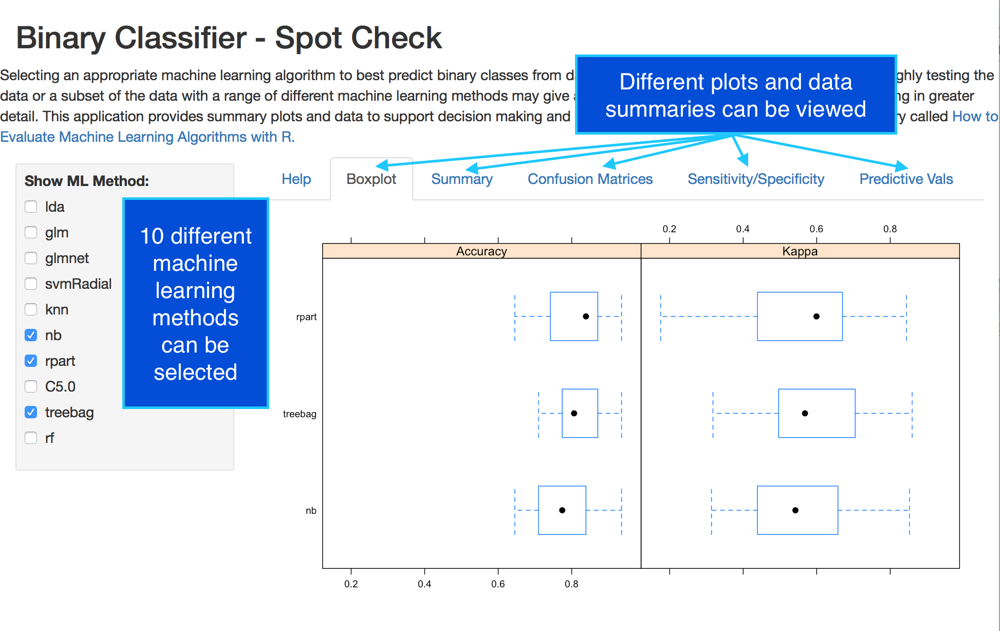

<style>
.reveal h1, .reveal h2, .reveal h3 {
  word-wrap: normal;
  -moz-hyphens: none;
}
</style>

<style>
.small-code pre code {
  font-size: 1em;
}
</style>
Binary Classifier Spot Check App
========================================================
author: 
date: 22nd June 2017
autosize: true

The Challenge of Choosing An ML Method
========================================================

- Selecting the best machine learning algorithm is challenging.
- It would be useful to quickly compare across different methods before investing time in refinements.
- The Binary Classifier Spot Check App supports 
  - any binary classification data set
  - 10 machine learning methods
  - boxplot comparison of Accuracy and Kappa for re-sampled training data
  - confusion matrices displaying counts; sensitivity and specificity; and positive and negative predictive values
- The Binary Classifier Spot Check App provides data and plots to support ML algorithm selection at an early stage.

App Screenshot
========================================================



Code Snippet with Results Summary
========================================================
class:small-code


```r
fit.lda <- train(result ~ ., data=sp, method="lda", metric=metric, 
                 preProc=c("center", "scale"), trControl=control)
fit.glm <- train(result ~ ., data=sp, method="glm", metric=metric, trControl=control)

summary(resamples(list(lda=fit.lda, glm=fit.glm)))
```

```

Call:
summary.resamples(object = resamples(list(lda = fit.lda, glm = fit.glm)))

Models: lda, glm 
Number of resamples: 30 

Accuracy 
      Min. 1st Qu. Median   Mean 3rd Qu.   Max. NA's
lda 0.7419  0.8065 0.8387 0.8419   0.871 0.9355    0
glm 0.7419  0.8065 0.8387 0.8398   0.871 0.9355    0

Kappa 
      Min. 1st Qu. Median   Mean 3rd Qu.   Max. NA's
lda 0.3404  0.5388 0.6404 0.6283  0.7158 0.8524    0
glm 0.4389  0.5388 0.6404 0.6393  0.7007 0.8597    0
```

Conclusion
========================================================
- The Binary Classifier Spot Check App is a convenient and quick way to kick off the machine learning method selection process.
- The following potential improvements could make it even more usable:
  - better colour choice and readability of text in confusion matrices
  - a data upload tool 
  - reduction in lag for confusion matrices
